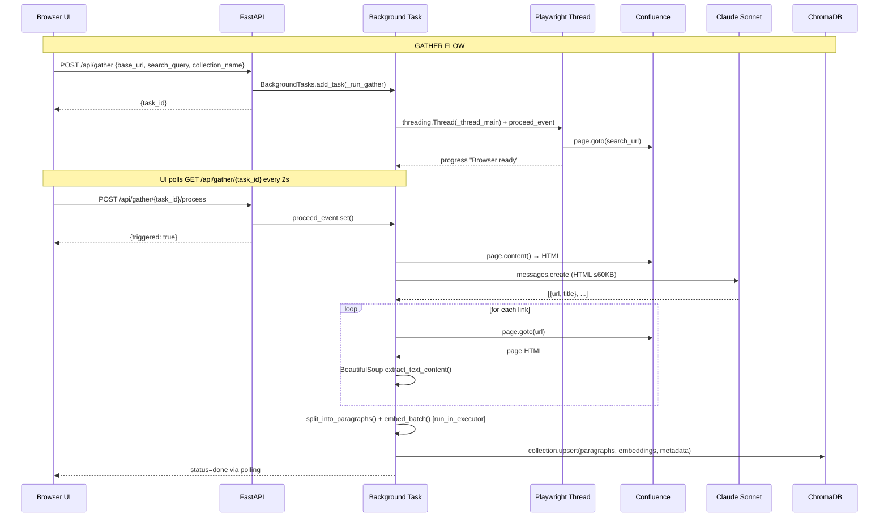
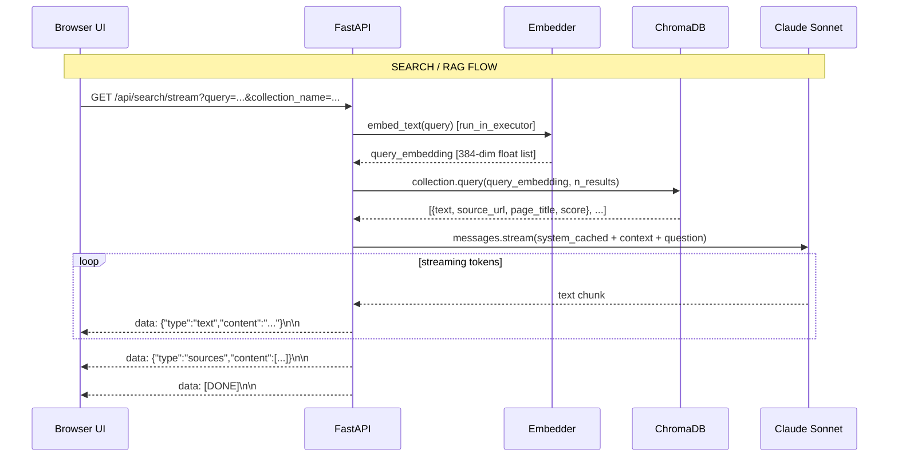

# KnowlegeScannerRAG — Developer Documentation

> Cross-reference: [User Guide](../../user/KnowlegeScannerRAG-user.md)

## Table of Contents

1. [Architecture Overview](#1-architecture-overview)
2. [Tech Stack](#2-tech-stack)
3. [Repository Layout](#3-repository-layout)
4. [Configuration](#4-configuration)
5. [Backend Module Reference](#5-backend-module-reference)
6. [API Reference](#6-api-reference)
7. [Data Models](#7-data-models)
8. [Gather Flow (step-by-step)](#8-gather-flow-step-by-step)
9. [Search / RAG Flow (step-by-step)](#9-search--rag-flow-step-by-step)
10. [ChromaDB Collection Name Constraints](#10-chromadb-collection-name-constraints)
11. [Frontend Architecture](#11-frontend-architecture)
12. [Known Constraints & Design Decisions](#12-known-constraints--design-decisions)
13. [Development Setup](#13-development-setup)
14. [Running & Testing](#14-running--testing)
15. [Extending the Application](#15-extending-the-application)

---

## 1. Architecture Overview

KnowlegeScannerRAG is a two-phase RAG (Retrieval-Augmented Generation) application: the **Gather** phase scrapes Confluence pages, embeds their text into a local vector database, and the **Search** phase embeds user queries to retrieve relevant chunks and streams a Claude-synthesized answer back to the browser.

```
                          ┌─────────────────────────────────────────────────────────────┐
                          │                     GATHER PHASE                            │
                          │                                                             │
  User clicks             │   Playwright (headed)                                       │
  "Open Browser" ────────►│   Chromium ──► Confluence search page                      │
                          │       │                                                     │
  User clicks             │       │  (user logs in / navigates)                        │
  "Process Page" ────────►│       ▼                                                     │
                          │   extract_links_with_claude()  ◄── Claude Sonnet 4.6        │
                          │       │   (HTML ≤60 KB → JSON [{url, title}])               │
                          │       ▼                                                     │
                          │   _scrape_page() × N  (BeautifulSoup lxml)                 │
                          │       │                                                     │
                          │       ▼                                                     │
                          │   split_into_paragraphs() + embed_batch()                  │
                          │       │        (all-MiniLM-L6-v2, run_in_executor)         │
                          │       ▼                                                     │
                          │   ChromaDB (cosine similarity, persistent on disk)          │
                          └─────────────────────────────────────────────────────────────┘

                          ┌─────────────────────────────────────────────────────────────┐
                          │                     SEARCH PHASE                            │
                          │                                                             │
  User submits query      │   embed_text(query)  (run_in_executor)                     │
  ──────────────────────►│       │                                                     │
                          │       ▼                                                     │
                          │   search_collection()  ◄── ChromaDB cosine query           │
                          │       │   (top-N chunks with scores)                       │
                          │       ▼                                                     │
                          │   client.messages.stream()  ◄── Claude Sonnet 4.6          │
                          │       │   (system prompt cached, context + question)       │
                          │       ▼                                                     │
                          │   SSE StreamingResponse  (text → sources → [DONE])         │
                          └─────────────────────────────────────────────────────────────┘
                                  │
                          EventSource in browser ──► Live answer + source chips
```

### Mermaid Sequence Diagrams





---

## 2. Tech Stack

| Layer | Technology | Version / Notes | Purpose |
|---|---|---|---|
| Python runtime | CPython | ≥ 3.10 (uses `X \| Y` union syntax) | Server-side language |
| Web framework | FastAPI | ≥ 0.104.0 | Async API + static file serving |
| ASGI server | uvicorn[standard] | ≥ 0.24.0 | HTTP server with hot-reload |
| Browser automation | Playwright | ≥ 1.40.0 (Chromium) | Headed browser for Confluence scraping |
| HTML parsing | BeautifulSoup4 + lxml | ≥ 4.12.0 / ≥ 4.9.3 | Main-content extraction from page HTML |
| Embedding model | sentence-transformers | ≥ 2.2.2 — `all-MiniLM-L6-v2` | 384-dim dense embeddings, CPU inference |
| Vector database | ChromaDB | ≥ 0.4.22 — PersistentClient | Cosine-similarity vector store, persisted to disk |
| LLM SDK | anthropic (Python) | ≥ 0.40.0 | Async Claude API client |
| LLM — link extraction | `claude-sonnet-4-6` | Non-streaming | Parse search result HTML into `[{url, title}]` |
| LLM — RAG answer | `claude-sonnet-4-6` | Streaming via `messages.stream()` | Synthesize answer from retrieved chunks |
| Env config | python-dotenv | ≥ 1.0.0 | Loads `.env` at startup |
| Data validation | Pydantic | ≥ 2.5.0 | Request body models |
| Frontend | Vanilla JS + HTML + CSS | No build step | SPA with three tabs, EventSource SSE consumer |

---

## 3. Repository Layout

```
KnowlegeScannerRAG/
├── run.py                  # Entry point: sets ProactorEventLoop on Windows, starts uvicorn
├── requirements.txt        # All Python dependencies with minimum versions
├── .env.example            # Template for required environment variables
├── CLAUDE.md               # AI-assistant guidance for this repo
│
├── backend/                # Python package — all server-side logic
│   ├── __init__.py         # Empty package marker
│   ├── config.py           # Loads .env; exports ANTHROPIC_API_KEY, CHROMA_PERSIST_DIR
│   ├── embedder.py         # Lazy-loads all-MiniLM-L6-v2; paragraph splitting + embedding
│   ├── vector_store.py     # ChromaDB singleton; store/search/list/delete collections
│   ├── scraper.py          # Playwright session (headed) + Claude link extraction + BS4 text
│   ├── rag.py              # Async generator streaming RAG answers via Claude
│   └── main.py             # FastAPI app: endpoints, background tasks, in-memory task state
│
├── frontend/               # Static files served by FastAPI StaticFiles mount
│   ├── index.html          # SPA shell: three-tab layout (Gather / Search / Collections)
│   ├── app.js              # All client-side logic: fetch, SSE, polling, tab switching
│   └── style.css           # CSS custom properties, card/tab/badge/chip component styles
│
├── chroma_db/              # Created at runtime — ChromaDB persistent storage (gitignored)
└── docs/
    └── dev/
        └── KnowlegeScannerRAG-dev.md   # This file
```

---

## 4. Configuration

### Environment Variables

All env vars are read in `backend/config.py` via `python-dotenv`. The `.env` file must be in the repo root.

| Variable | Required | Default | Description | Example |
|---|---|---|---|---|
| `ANTHROPIC_API_KEY` | **Yes** | `""` | Anthropic API key for Claude calls (both link extraction and RAG) | `sk-ant-api03-...` |
| `CHROMA_PERSIST_DIR` | No | `./chroma_db` | Directory where ChromaDB writes its SQLite + HNSW index files | `./chroma_db` |
| `CONFLUENCE_BASE_URL` | No (UI-only hint in `.env.example`) | — | Not read by backend code; included in `.env.example` as a convenience reminder for users | `https://your-confluence.atlassian.net` |

### ChromaDB Persistence

`CHROMA_PERSIST_DIR` defaults to `./chroma_db` relative to the **working directory**, which must be the repo root. The directory is created automatically by ChromaDB on first use. Data survives server restarts; in-memory task records do not.

### Hardcoded Architectural Constants

| Constant | Location | Value | Significance |
|---|---|---|---|
| HTML truncation limit | `scraper.py:21` | `60_000` characters | Maximum HTML sent to Claude for link extraction; prevents token limit errors |
| Embedding model name | `embedder.py:10` | `"all-MiniLM-L6-v2"` | 384-dim model; changing it invalidates all stored embeddings |
| Claude model (scraper) | `scraper.py:23` | `"claude-sonnet-4-6"` | Used for link extraction from HTML |
| Claude model (RAG) | `rag.py:41` | `"claude-sonnet-4-6"` | Used for streaming answer synthesis |
| RAG max tokens | `rag.py:42` | `2000` | Maximum tokens in Claude's RAG response |
| Paragraph min length | `embedder.py:14` | `100` characters | Paragraphs shorter than this are merged with the next |
| Browser wait after load | `scraper.py:123` | `1500` ms | Extra pause after `domcontentloaded` to let JS-rendered content settle |
| Per-page scrape wait | `scraper.py:79` | `1500` ms | Pause on each page before capturing HTML |
| Poll interval | `app.js:77` | `2000` ms | How often the frontend polls `GET /api/gather/{task_id}` |

---

## 5. Backend Module Reference

### `backend/config.py`

**Purpose:** Loads the `.env` file and exports two string constants consumed by other modules.

| Symbol | Type | What it does |
|---|---|---|
| `ANTHROPIC_API_KEY` | `str` | Anthropic API key; empty string if unset |
| `CHROMA_PERSIST_DIR` | `str` | Path for ChromaDB persistence; defaults to `./chroma_db` |

No public functions. Called at import time via `load_dotenv()`.

---

### `backend/embedder.py`

**Purpose:** Provides lazy-loaded sentence-transformer embeddings and paragraph splitting.

| Function | Signature | What it does | Side effects / exceptions |
|---|---|---|---|
| `split_into_paragraphs` | `(text: str, min_length: int = 100) -> list[str]` | Splits text on double newlines, merges short fragments into previous paragraph until `min_length` is reached; last orphan is appended to preceding paragraph | None |
| `embed_text` | `(text: str) -> list[float]` | Encodes a single string with all-MiniLM-L6-v2; returns a 384-element float list | Loads model on first call (downloads ~90 MB if not cached); CPU-bound, blocks caller thread |
| `embed_batch` | `(texts: list[str]) -> list[list[float]]` | Encodes multiple strings in one model call; returns a list of 384-element float lists | Same as `embed_text` |

**Key implementation notes:**
- The model is stored in module-level `_model` and loaded only on first access (`_get_model()`). This avoids the 1–3 second load cost at import time and across hot-reloads.
- Both `embed_text` and `embed_batch` are **synchronous and CPU-bound**. They must be called via `run_in_executor` from async code to avoid blocking the uvicorn event loop.

---

### `backend/vector_store.py`

**Purpose:** Wraps a singleton ChromaDB `PersistentClient` with typed helpers for storing and retrieving paragraph embeddings.

| Function | Signature | What it does | Side effects / exceptions |
|---|---|---|---|
| `store_paragraphs` | `(collection_name, paragraphs, embeddings, source_url, page_title) -> int` | Upserts paragraphs + embeddings into a cosine-similarity collection; returns count stored | Creates collection if absent; upsert is idempotent (ID = `{url}#{index}`) |
| `search_collection` | `(collection_name, query_embedding, n_results=5) -> list[dict]` | Queries collection; returns up to `n_results` chunks sorted by cosine similarity descending | Returns `[]` if collection doesn't exist (no exception) |
| `list_collections` | `() -> list[str]` | Returns sanitized names of all ChromaDB collections | None |
| `delete_collection` | `(name: str) -> bool` | Deletes collection by sanitized name; returns `True` on success, `False` if not found | Irreversible |

**Key implementation notes:**
- Collection names are sanitized via `_sanitize_name()` before every ChromaDB call — both reads and writes — so the stored name may differ from what the user typed. See [Section 10](#10-chromadb-collection-name-constraints).
- The ChromaDB client (`_client`) is a module-level singleton initialized on first access. It opens a file lock on `CHROMA_PERSIST_DIR`; running two server instances against the same directory will error.
- Cosine similarity is enabled at collection creation via `metadata={"hnsw:space": "cosine"}`. The raw ChromaDB distance is `1 - cosine_similarity`; `search_collection` returns `score = round(1 - dist, 4)` so higher is better.

---

### `backend/scraper.py`

**Purpose:** Drives a headed Playwright browser to open Confluence, waits for user interaction, then extracts page links via Claude and scrapes each page with BeautifulSoup.

| Function | Signature | What it does | Side effects / exceptions |
|---|---|---|---|
| `extract_links_with_claude` | `async (html, base_url, search_query) -> list[dict]` | Truncates HTML to 60 KB, calls Claude Sonnet, regex-extracts JSON array `[{url, title}]`, resolves relative URLs | Calls Anthropic API; returns `[]` on parse failure |
| `extract_text_content` | `(html: str) -> str` | Parses HTML with lxml, strips script/style/nav/header/footer, returns text of `#main-content` → `.wiki-content` → `#content` → `main` → `article` → `body` (first match) | Synchronous; no network I/O |
| `search_confluence` | `async (base_url, search_query, username="", password="", max_pages=10, progress_callback=None, proceed_event=None) -> list[dict]` | Orchestrator: spawns Playwright thread, drains progress queue, returns list of `{url, title, text}` dicts | Blocks until Playwright thread finishes; re-raises thread exceptions |

**Private internals (not imported elsewhere):**

| Function | What it does |
|---|---|
| `_playwright_session` | Async function running inside the ProactorEventLoop thread: opens browser, navigates, waits for `proceed_event`, extracts links, scrapes pages |
| `_scrape_page` | Navigates Playwright `page` to URL, waits 1.5 s, returns `(title, clean_text)` |
| `_wait_for_browser_close` | Registers a `disconnected` listener on the browser object and awaits a Future; blocks until user closes the browser window |

**Key implementation notes:**
- **ProactorEventLoop thread isolation:** `search_confluence` spawns a `threading.Thread` that creates its own `asyncio.ProactorEventLoop` (Windows) or `asyncio.new_event_loop()` (other platforms). This is necessary because uvicorn on Windows forces `WindowsSelectorEventLoopPolicy`, which cannot `subprocess_exec` — a requirement for Playwright's process transport.
- **Thread ↔ async bridge:** Progress messages travel from the Playwright thread to the uvicorn event loop via a `queue.Queue`. The async `search_confluence` polls the queue with 0.1 s timeout and 50 ms `asyncio.sleep` gaps to yield control without busy-waiting.
- **Two-step proceed:** `proceed_event` is a `threading.Event` created in `main.py` before the task starts and stored in the `tasks` dict. The Playwright thread polls `proceed_event.is_set()` every 300 ms and only processes the page after the HTTP handler calls `proceed_event.set()`.
- **Headed browser:** `headless=False` is intentional so users can authenticate with Confluence SSO/MFA through the visible browser window.

---

### `backend/rag.py`

**Purpose:** Async generator that embeds a query, retrieves relevant chunks from ChromaDB, and streams a Claude-synthesized answer as SSE events.

| Symbol | Signature | What it does | Side effects / exceptions |
|---|---|---|---|
| `SYSTEM_PROMPT` | `str` constant | Instructs Claude to answer only from provided context and cite sources | — |
| `rag_search_stream` | `async (query, collection_name, n_results=5) -> AsyncIterator[str]` | Embeds query → retrieves chunks → streams Claude answer → yields SSE events | Calls Anthropic streaming API; yields a single "no content" event if collection is empty |

**SSE events yielded (in order):**

1. Zero or more `data: {"type":"text","content":"<token>"}\n\n` — streaming answer tokens
2. `data: {"type":"sources","content":[{text, source_url, page_title, score}, ...]}\n\n` — retrieved chunks
3. `data: [DONE]\n\n` — terminal signal

**Key implementation notes:**
- `cache_control: {"type": "ephemeral"}` is applied to the system prompt. On repeated calls with the same system prompt, the Anthropic API reuses the cached KV state, reducing input token cost.
- `embed_text` is synchronous/CPU-bound; it is dispatched via `_run_sync` → `loop.run_in_executor(None, fn, *args)` to prevent blocking the event loop.
- Context passed to Claude is formatted as numbered excerpts: `[1] Source: PageTitle (url)\n<text>\n\n---\n\n[2] ...`.

---

### `backend/main.py`

**Purpose:** FastAPI application — defines all HTTP endpoints, manages background gather tasks in an in-memory dict, and mounts the frontend as a static file catch-all.

**Key implementation notes:**
- `tasks` is a module-level `dict[str, dict]`. It is lost on server restart; ChromaDB data is not.
- `proceed_event` (a `threading.Event`) is stored in each task record but **excluded** from the `GET /api/gather/{task_id}` response (filtered via dict comprehension) because `threading.Event` is not JSON-serializable.
- The `StaticFiles` mount on `"/"` is registered **last**, after all API routes, so that `/api/*` paths are matched first by FastAPI's router.
- `embed_batch` is called via `asyncio.get_event_loop().run_in_executor(None, embed_batch, paragraphs)` inside `_run_gather` to keep the event loop free during CPU-bound embedding.

---

## 6. API Reference

### `POST /api/gather`

Opens a Playwright browser session, navigates to Confluence, and starts a background gather task. Returns immediately; browser launch happens asynchronously.

**Request body** (`GatherRequest`):

| Field | Type | Default | Description |
|---|---|---|---|
| `base_url` | `str` | required | Confluence instance root, e.g. `https://your.atlassian.net` |
| `search_query` | `str` | required | Search term to navigate to on Confluence |
| `collection_name` | `str` | required | Target ChromaDB collection name (sanitized before storage) |
| `username` | `str \| null` | `""` | HTTP Basic auth username; leave empty for manual login |
| `password` | `str \| null` | `""` | HTTP Basic auth password |
| `max_pages` | `int` | `10` | Maximum number of Confluence pages to scrape |

**Response** `200 OK`:
```json
{ "task_id": "550e8400-e29b-41d4-a716-446655440000" }
```

**Example:**
```bash
curl -s -X POST http://localhost:8000/api/gather \
  -H "Content-Type: application/json" \
  -d '{"base_url":"https://wiki.example.com","search_query":"deployment","collection_name":"deploy-kb","max_pages":10}'
```

---

### `POST /api/gather/{task_id}/process`

Signals the waiting Playwright session to capture the current browser page and begin scraping. Must be called while task status is `waiting_for_user`.

**Path parameter:** `task_id` — UUID returned by `POST /api/gather`

**Response** `200 OK`:
```json
{ "triggered": true }
```

**Error responses:**

| Status | Detail |
|---|---|
| `404` | `"Task not found"` |
| `400` | `"Task is in state '<state>', expected 'waiting_for_user'"` |

**Example:**
```bash
curl -s -X POST http://localhost:8000/api/gather/550e8400-e29b-41d4-a716-446655440000/process
```

---

### `GET /api/gather/{task_id}`

Polls the status and progress log of a gather task.

**Path parameter:** `task_id` — UUID returned by `POST /api/gather`

**Response** `200 OK`:
```json
{
  "status": "waiting_for_user",
  "progress": ["Opening Confluence...", "Browser ready. Log in if needed..."],
  "total_paragraphs": 0
}
```

The `proceed_event` field is stripped before serialization.

**Possible `status` values:** `waiting_for_user` → `processing` → `done` | `error`

**Error responses:**

| Status | Detail |
|---|---|
| `404` | `"Task not found"` |

**Example:**
```bash
curl -s http://localhost:8000/api/gather/550e8400-e29b-41d4-a716-446655440000
```

---

### `GET /api/search/stream`

Streams a RAG answer as Server-Sent Events. Must use GET (not POST) because `EventSource` only supports GET.

**Query parameters:**

| Parameter | Type | Default | Description |
|---|---|---|---|
| `query` | `str` | required | Natural-language question |
| `collection_name` | `str` | required | Sanitized ChromaDB collection name to search |
| `n_results` | `int` | `5` | Number of chunks to retrieve and pass as context |

**Response** `200 OK` — `text/event-stream` with `Cache-Control: no-cache` and `X-Accel-Buffering: no`

Event stream format:
```
data: {"type": "text", "content": "Here is..."}

data: {"type": "text", "content": " the answer"}

data: {"type": "sources", "content": [{"text": "...", "source_url": "https://...", "page_title": "Page Name", "score": 0.87}]}

data: [DONE]
```

**Error responses:**

| Status | Detail |
|---|---|
| `400` | `"Query cannot be empty"` |
| `400` | `"collection_name cannot be empty"` |

**Example (requires `--no-buffer` to see streaming):**
```bash
curl -sN "http://localhost:8000/api/search/stream?query=how+to+deploy&collection_name=deploy-kb&n_results=5"
```

---

### `GET /api/collections`

Lists all ChromaDB collection names currently stored on disk.

**Response** `200 OK`:
```json
{ "collections": ["deploy-kb", "onboarding_kb"] }
```

**Example:**
```bash
curl -s http://localhost:8000/api/collections
```

---

### `DELETE /api/collections/{name}`

Permanently deletes a ChromaDB collection and all its stored paragraphs.

**Path parameter:** `name` — collection name (will be sanitized internally)

**Response** `200 OK`:
```json
{ "deleted": "deploy-kb" }
```

**Error responses:**

| Status | Detail |
|---|---|
| `404` | `"Collection not found"` |

**Example:**
```bash
curl -s -X DELETE http://localhost:8000/api/collections/deploy-kb
```

---

## 7. Data Models

### `GatherRequest` (Pydantic)

```python
class GatherRequest(BaseModel):
    base_url: str           # required, no validation beyond type
    search_query: str       # required
    collection_name: str    # required; sanitized before ChromaDB use
    username: Optional[str] = ""
    password: Optional[str] = ""
    max_pages: int = 10
```

No length or format validation is applied at the Pydantic layer; all sanitization happens inside `scraper.py` and `vector_store.py`.

---

### In-Memory `tasks` Dict

Shape at each status transition:

```python
# Immediately after POST /api/gather
tasks[task_id] = {
    "status": "waiting_for_user",
    "progress": [],
    "total_paragraphs": 0,
    "proceed_event": threading.Event(),   # not serialized in GET response
}

# While _playwright_session is running (browser open)
tasks[task_id]["progress"] = [
    "Opening Confluence...",
    "Browser ready. Log in if needed...",
    ...
]

# After POST /api/gather/{task_id}/process
tasks[task_id]["status"] = "processing"
# proceed_event is now set

# After scraping + embedding completes
tasks[task_id] = {
    "status": "done",
    "progress": [...all messages...],
    "total_paragraphs": 247,
    "proceed_event": <threading.Event set=True>,
}

# On any exception in _run_gather
tasks[task_id] = {
    "status": "error",
    "progress": [..., "Error: <message>"],
    "total_paragraphs": 0,
    "error": "<exception string>",
    "proceed_event": ...,
}
```

---

### ChromaDB Document Schema

Each paragraph is stored as one ChromaDB document. Per-document metadata:

| Field | Type | Value |
|---|---|---|
| `source_url` | `str` | Full URL of the Confluence page the paragraph came from |
| `page_title` | `str` | `<title>` element value from the scraped page |
| `para_index` | `int` | Zero-based index of the paragraph within that page |

Document ID is `f"{source_url}#{para_index}"` — deterministic, enabling idempotent upserts. Re-scraping a page overwrites its existing paragraphs.

---

### SSE Event Shapes

| `type` | `content` type | Description |
|---|---|---|
| `text` | `str` | A streaming token fragment from Claude's response |
| `sources` | `list[dict]` | Retrieved chunks: `[{text, source_url, page_title, score}]` |
| `[DONE]` | — | Raw string `[DONE]` (not JSON); signals end of stream |

When no chunks are found, the stream emits one `text` event with the message `"No relevant content found in the knowledge base."` followed by `[DONE]`.

---

## 8. Gather Flow (step-by-step)

1. **`POST /api/gather`** — FastAPI handler creates a `threading.Event` (`proceed_event`), initializes the task record with `status: waiting_for_user`, adds `_run_gather` to `BackgroundTasks`, and returns `{task_id}`.

2. **`_run_gather` starts** (uvicorn event loop, background coroutine) — calls `search_confluence(...)` passing the `proceed_event`.

3. **`search_confluence`** creates a `queue.Queue`, spawns `threading.Thread(_thread_main, daemon=True)`, then enters an async drain loop reading from the queue.

4. **`_thread_main` (new OS thread)** — creates `asyncio.ProactorEventLoop` on Windows (or `new_event_loop()` on Linux/Mac), runs `_playwright_session(...)` on it until completion.

5. **`_playwright_session`** — calls `async_playwright().start()`, launches a headed Chromium browser, creates a context (optionally sets HTTP Basic credentials), navigates to `{base_url}/search?text={query}`, waits 1.5 s, posts "Browser ready" progress, then **polls `proceed_event.is_set()` every 300 ms**.

6. **UI polls `GET /api/gather/{task_id}` every 2 s** — frontend sees `status: waiting_for_user`, shows "Process Current Page" button.

7. **User authenticates and navigates** in the visible browser window.

8. **User clicks "Process Current Page"** — frontend calls `POST /api/gather/{task_id}/process`.

9. **`trigger_process` handler** — validates status is `waiting_for_user`, sets `status: processing`, calls `proceed_event.set()`.

10. **`_playwright_session` unblocks** — calls `page.content()` to capture current HTML, calls `extract_links_with_claude()` (truncates to 60 KB, calls Claude Sonnet, regex-parses JSON array of links).

11. **Link scraping loop** — for each link (up to `max_pages`): navigates to URL, waits 1.5 s, calls `extract_text_content()` (BeautifulSoup lxml, targets `#main-content` → `.wiki-content` → fallback chain), joins non-empty lines with double newlines.

12. **Browser stays open** — after scraping, `_wait_for_browser_close` blocks until the user closes the browser window. `pw.stop()` is called in `finally`.

13. **Thread pushes `("done", None)`** to the queue and returns scraped pages.

14. **`search_confluence` unblocks** — joins the thread, re-raises any exception, returns `list[{url, title, text}]`.

15. **`_run_gather` continues** — calls `split_into_paragraphs()` on each page's text, then dispatches `embed_batch()` via `run_in_executor` (unblocks event loop during CPU work), calls `store_paragraphs()` which upserts to ChromaDB.

16. **Task completes** — `status: done`, `total_paragraphs` updated, final progress message written.

---

## 9. Search / RAG Flow (step-by-step)

1. **`GET /api/search/stream?query=...&collection_name=...&n_results=5`** — FastAPI validates non-empty params, returns a `StreamingResponse` wrapping the `rag_search_stream` async generator with `text/event-stream` media type and `Cache-Control: no-cache`, `X-Accel-Buffering: no` headers.

2. **`rag_search_stream` starts** — calls `_run_sync(embed_text, query)` which dispatches `embed_text` to the thread pool via `loop.run_in_executor`. The event loop remains free during CPU embedding.

3. **Embedding returns** — 384-dimensional float list.

4. **`search_collection(collection_name, query_embedding, n_results)`** — sanitizes collection name, calls `collection.query()` with cosine distance, converts distances to scores (`1 - dist`), returns `list[{text, source_url, page_title, score}]`. Returns `[]` if collection not found.

5. **Empty check** — if no chunks, yields a single `text` event with a "not found" message and `[DONE]`; returns.

6. **Context assembly** — chunks are formatted as `[1] Source: PageTitle (url)\n<text>` blocks joined by `\n\n---\n\n`.

7. **`client.messages.stream()`** — calls Claude Sonnet 4.6 with:
   - `system` array containing one text block with `cache_control: {"type": "ephemeral"}` (caches the system prompt across repeated calls)
   - `messages` array with a single user message: `Context:\n{context}\n\nQuestion: {query}`
   - `max_tokens: 2000`

8. **Token streaming** — for each text token from `stream.text_stream`, yields `data: {"type":"text","content":"<token>"}\n\n`.

9. **Sources event** — after the stream closes, yields `data: {"type":"sources","content":[...]}\n\n` with the full chunk list.

10. **Done signal** — yields `data: [DONE]\n\n`.

11. **Browser EventSource** — `es.onmessage` appends text tokens directly to `#answer-box` with a blinking cursor; on `sources` event, `renderSources()` creates clickable `<a class="source-chip">` elements. On `[DONE]`, cursor is removed, button re-enabled.

---

## 10. ChromaDB Collection Name Constraints

ChromaDB enforces strict naming rules on collection names. The `_sanitize_name()` function in `vector_store.py` normalizes user input before every ChromaDB operation:

```python
def _sanitize_name(name: str) -> str:
    sanitized = re.sub(r"[^a-zA-Z0-9_-]", "_", name)  # replace disallowed chars
    sanitized = sanitized[:63]                           # truncate to max length
    if len(sanitized) < 3:
        sanitized = sanitized + "_kb"                   # ensure minimum length
    return sanitized
```

| Rule | Value |
|---|---|
| Allowed characters | `a–z`, `A–Z`, `0–9`, `_`, `-` |
| Disallowed characters | Replaced with `_` (spaces, dots, slashes, `@`, etc.) |
| Maximum length | 63 characters |
| Minimum length | 3 characters (padded with `_kb` if needed) |

**Consequence for the UI:** The collection name typed in the form and the name stored in ChromaDB may differ. For example, `"Deploy KB"` becomes `"Deploy_KB"`. The Collections tab shows stored (sanitized) names. When submitting a search query, users must select the collection from the dropdown which is populated from `GET /api/collections` (sanitized names), so there is no mismatch at query time.

Sanitization is applied on every `store_paragraphs`, `search_collection`, and `delete_collection` call, so the caller never needs to pre-sanitize.

---

## 11. Frontend Architecture

### Tab Structure

The SPA has three tabs managed by `data-tab` attributes. Tab switching in `app.js` sets `.active` on both the button and the panel, and refreshes data on tab entry:

| Tab | Panel ID | On entry |
|---|---|---|
| Gather Data | `#tab-gather` | Nothing (form is static) |
| Smart Search | `#tab-search` | `loadCollectionsIntoSelect()` |
| Collections | `#tab-collections` | `loadCollections()` |

### Gather Tab JS Flow

| Event | Handler | Action |
|---|---|---|
| Click "Open Browser" | `btn-gather` listener | `POST /api/gather`, store `task_id` in `currentTaskId`, start `setInterval(pollGather, 2000)` |
| Poll interval fires | `pollGather(taskId, btn)` | `GET /api/gather/{task_id}`, append new progress lines, update badge, show/hide `#process-action` |
| `status === waiting_for_user` | Inside `pollGather` | Show `#process-action` div containing "Process Current Page" button |
| Click "Process Current Page" | `btn-process` listener | `POST /api/gather/{currentTaskId}/process`, hide action div |
| `status === done \| error` | Inside `pollGather` | `clearInterval`, re-enable "Open Browser" button |

### Search Tab JS Flow

| Event | Handler | Action |
|---|---|---|
| Click "Ask" | `btn-search` listener | Build `URLSearchParams`, open `EventSource` |
| SSE `message` (type=text) | `es.onmessage` | Append token to `textBuffer`, set `answerBox.textContent`, re-attach blinking cursor |
| SSE `message` (type=sources) | `es.onmessage` | Call `renderSources()` — creates `<a class="source-chip">` per chunk |
| SSE `data: [DONE]` | `es.onmessage` | `es.close()`, remove cursor, re-enable button |
| SSE error | `es.onerror` | `es.close()`, re-enable button |

### Why GET for Search

The browser's native `EventSource` API only supports GET requests. POST-based SSE would require a polyfill or `fetch` with `ReadableStream`. The query parameters are passed as URL query string: `?query=...&collection_name=...&n_results=...`.

### Frontend State

| Variable | Scope | Purpose |
|---|---|---|
| `gatherPollInterval` | module | `setInterval` handle; cleared on task completion |
| `lastProgressIndex` | module | Index into `data.progress[]` to avoid re-displaying already-shown messages |
| `currentTaskId` | module | UUID of the active gather task; used by "Process Current Page" handler |
| `activeEventSource` | module | `EventSource` instance; closed before starting a new search |
| `textBuffer` | per-search closure | Accumulates streaming text tokens before writing to DOM |

---

## 12. Known Constraints & Design Decisions

- **Playwright runs headed** — Confluence instances typically use SSO/MFA (Atlassian Cloud, corporate SAML). A headless browser cannot interact with these flows; the user must authenticate manually in the visible window.
- **Two-step gather (open → process)** — The original single-step approach captured the search results page before the user had logged in. Splitting into "open browser" and "process current page" gives the user time to authenticate and navigate to the correct results page before triggering extraction.
- **Playwright in a dedicated OS thread with ProactorEventLoop** — uvicorn on Windows sets `WindowsSelectorEventLoopPolicy`, which does not support `subprocess_exec`. Playwright requires subprocess creation for its Chromium transport. Running Playwright in a thread with an explicit `asyncio.ProactorEventLoop` isolates it from uvicorn's loop entirely.
- **`threading.Event` for proceed signal** — A `threading.Event` can be set from any thread (the HTTP handler's coroutine) and read from any thread (the Playwright thread's polling loop), with no asyncio loop boundary constraints. An `asyncio.Event` would require loop-affinity that breaks across the thread boundary.
- **Progress via `queue.Queue`** — The Playwright thread and the uvicorn event loop run in different threads. A `queue.Queue` is the standard thread-safe bridge; the async drain loop polls it with a 50 ms sleep to yield control.
- **Gather task state is in-memory** — Adding a database for task state was out of scope for MVP. Restarting the server clears all task records; ChromaDB data on disk is unaffected.
- **HTML truncated at 60 KB for Claude** — Confluence search pages include substantial navigation HTML. Claude's effective reasoning window is best used on the search result area, not boilerplate. Truncation at 60 KB keeps costs predictable and avoids token limit errors.
- **`cache_control: ephemeral` on system prompt** — The RAG system prompt is identical across all queries to a given collection. Marking it ephemeral lets the Anthropic API cache the prompt's KV state across repeated calls within a 5-minute window, reducing input token cost.
- **Static files mounted last** — FastAPI registers routes in order. Mounting `StaticFiles` on `"/"` last ensures all `/api/*` paths are resolved by the router before falling through to the static catch-all.
- **Sentence-transformers lazy-loaded** — The model download (~90 MB) and first-load time (~1–3 s) happen only on first actual embedding call, not at import time. This keeps server startup fast and avoids unnecessary work if the user only browses collections.
- **ChromaDB `_sanitize_name` on every call** — Sanitization is applied in `vector_store.py` rather than in callers so no caller can accidentally bypass it and create a collection with an invalid name.

---

## 13. Development Setup

**Prerequisites:** Python 3.10+, pip, internet access (for model download and Playwright browser install).

```bash
# 1. Clone / enter the repository
cd c:/source/KnowlegeScannerRAG

# 2. (Recommended) Create a virtual environment
python -m venv .venv
# Windows:
.venv\Scripts\activate
# Mac/Linux:
source .venv/bin/activate

# 3. Install Python dependencies
pip install -r requirements.txt

# 4. Install Playwright's Chromium browser (first time only, ~150 MB download)
playwright install chromium

# 5. Configure environment
copy .env.example .env       # Windows
# cp .env.example .env       # Mac/Linux
# Then edit .env and set ANTHROPIC_API_KEY=sk-ant-...

# 6. Run the server (must be from repo root)
python run.py
# Starts uvicorn on http://0.0.0.0:8000 with hot-reload
# Open http://localhost:8000 in your browser
```

**Why run from repo root:**
- FastAPI's `StaticFiles(directory="frontend")` resolves relative to the working directory.
- `backend/config.py`'s `CHROMA_PERSIST_DIR` default `./chroma_db` resolves relative to the working directory.
- The `backend` package import requires the repo root on `sys.path`, which uvicorn handles automatically when given `"backend.main:app"` as the app string.

**Hot-reload note:** `run.py` passes `reload=True` to uvicorn. File changes in `backend/` and `frontend/` are detected automatically. The Playwright browser window from an in-progress gather task will be orphaned on reload; close it manually.

**First embedding call:** On the first `POST /api/gather` that reaches the embedding step, sentence-transformers will download `all-MiniLM-L6-v2` (~90 MB) to `~/.cache/huggingface/` if not already cached. This is a one-time cost.

---

## 14. Running & Testing

### Start the server

```bash
python run.py
# → INFO: Uvicorn running on http://0.0.0.0:8000
```

### Exercise the gather endpoint manually

```bash
# Step 1: Open browser
TASK=$(curl -s -X POST http://localhost:8000/api/gather \
  -H "Content-Type: application/json" \
  -d '{"base_url":"https://wiki.example.com","search_query":"onboarding","collection_name":"onboarding-kb","max_pages":5}' \
  | python -c "import sys,json; print(json.load(sys.stdin)['task_id'])")

echo "Task ID: $TASK"

# Step 2: Poll until waiting_for_user
curl -s http://localhost:8000/api/gather/$TASK

# Step 3: (After authenticating in browser) Trigger processing
curl -s -X POST http://localhost:8000/api/gather/$TASK/process

# Step 4: Poll until done
curl -s http://localhost:8000/api/gather/$TASK
```

### Exercise the search stream endpoint

```bash
# Requires --no-buffer (-N) to see SSE events as they arrive
curl -sN "http://localhost:8000/api/search/stream?query=how+do+I+onboard&collection_name=onboarding-kb&n_results=5"
```

### List and delete collections

```bash
curl -s http://localhost:8000/api/collections

curl -s -X DELETE http://localhost:8000/api/collections/onboarding-kb
```

### Tests

No automated test files are present in this repository. All verification is currently done by running the server and exercising the UI or curl commands above.

---

## 15. Extending the Application

### Adding a new API endpoint

Add a new route function in `backend/main.py` **before** the `app.mount(...)` call at the bottom of the file. Follow the existing pattern:

```python
@app.get("/api/my-new-endpoint")
async def my_endpoint(param: str):
    return {"result": param}
```

FastAPI auto-generates OpenAPI docs at `http://localhost:8000/docs`.

### Swapping the embedding model

1. Change the model name string in `backend/embedder.py:10` from `"all-MiniLM-L6-v2"` to your chosen model.
2. **Delete all existing ChromaDB collections** — the embedding dimension will change, making old vectors incompatible. Drop the `chroma_db/` directory or use `DELETE /api/collections/{name}` for each collection.
3. If the new model produces embeddings of a different dimension, no code change is needed — ChromaDB infers dimension from the first upsert.

### Changing the ChromaDB backend

`vector_store.py` uses `chromadb.PersistentClient`. To switch to a remote ChromaDB server:

```python
# Replace in _get_client():
_client = chromadb.HttpClient(host="your-chroma-host", port=8000)
```

To switch to an entirely different vector store (Pinecone, Qdrant, Weaviate, pgvector), replace the four functions in `vector_store.py` (`store_paragraphs`, `search_collection`, `list_collections`, `delete_collection`) with equivalent calls to the new client. The rest of the codebase depends only on the return types of these four functions.

### Adding authentication to the web app

The FastAPI app currently has no authentication. To add HTTP Basic auth or API key auth to the API endpoints:

```python
from fastapi.security import HTTPBearer, HTTPAuthorizationCredentials
from fastapi import Depends, Security

security = HTTPBearer()

def verify_token(credentials: HTTPAuthorizationCredentials = Security(security)):
    if credentials.credentials != os.getenv("API_TOKEN"):
        raise HTTPException(status_code=401, detail="Invalid token")

# Then add `dependencies=[Depends(verify_token)]` to each route or to the FastAPI() constructor
```

The frontend would need to add `Authorization: Bearer <token>` to all `fetch()` calls and the `EventSource` URL (EventSource does not support custom headers; for SSE auth, pass the token as a query parameter and validate it server-side).
